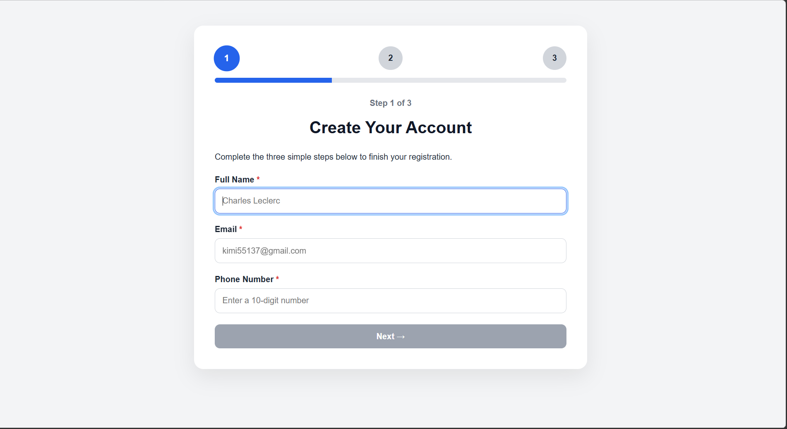
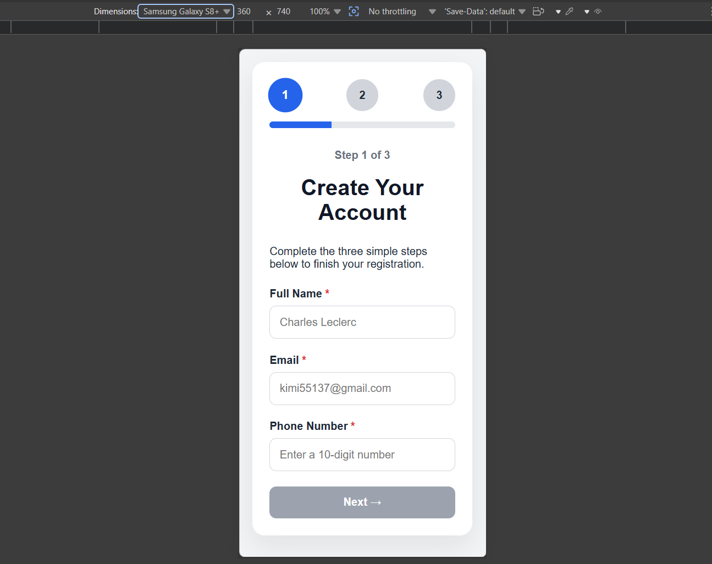
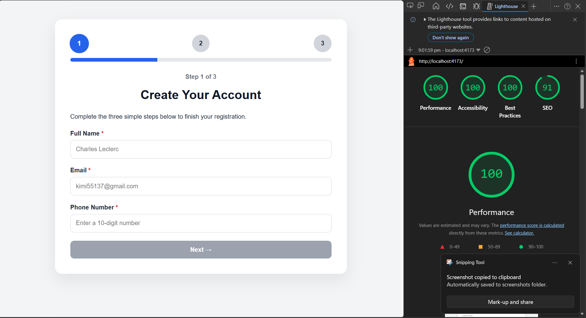

# Multi-Step Onboarding Wizard

A responsive multi-step onboarding wizard built with **React**, **React Hook Form**, and **Zod**. The application demonstrates modern form handling, real-time validation, state management, and an improved user experience for multi-step registration flows.

## Features

- Three-step onboarding process
- Personal Information form
- Account Details form
- Review & Submit page
- Success confirmation screen
- React Hook Form integration
- Zod schema validation
- Real-time form validation
- Disabled Next button until fields are valid
- Show/Hide password toggle
- Progress bar indicating current step
- Persistent form state between steps
- Responsive design
- Semantic HTML
- Accessibility improvements (ARIA attributes)

## Tech Stack

- React
- Vite
- React Hook Form
- Zod
- JavaScript (ES6+)
- HTML5
- CSS3

## Live Demo
https://onboarding-wizard-7.netlify.app/

## Screenshots
### Desktop View

### Mobile View

### Lighthouse Report

